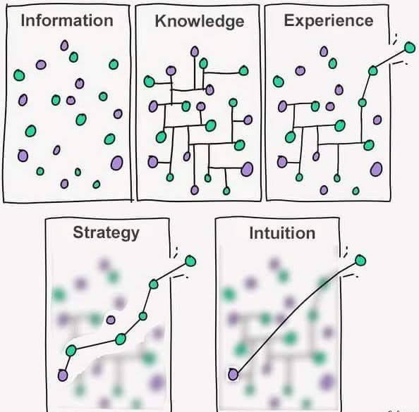

# Knowra - Graph-based AI Memory Engine

> A graph-based AI memory engine that stores, connects, and retrieves knowledge for AI agents.

[](https://opensource.org/licenses/MIT)
[]()

## Core Mission

**Persistent memory for AI agents with intelligent retrieval.**

Knowra is an AI memory engine that gives AI agents the ability to remember, connect, and intelligently retrieve information across conversations and sessions. Unlike traditional databases, Knowra:

- **Stores AI conversations** with semantic understanding and context
- **Builds knowledge graphs** automatically from agent interactions
- **Enables intelligent retrieval** through hybrid semantic and text search
- **Tracks usage patterns** to improve future recommendations
- **Maintains context** across multiple sessions and conversations
- **Scales memory** from simple facts to complex reasoning chains

## AI Memory Architecture

Knowra organizes AI agent memory through five intelligence levels:

**Information** → **Knowledge** → **Experience** → **Strategy** → **Intuition**

Each level represents how AI agents can progressively build understanding from raw data to intelligent decision-making patterns.

## Quick Start for AI Agents

```bash
npm install knowra
```

```typescript
import { KnowledgeDatabase } from 'knowra';

// Initialize AI agent memory
const agentMemory = new KnowledgeDatabase();

// Level 1: Information - Store AI agent observations
const userQuestion = agentMemory.information.add("User asked about React performance");
const codeExample = agentMemory.information.add("Found React.memo optimization example");

// Level 2: Knowledge - Connect related concepts
agentMemory.knowledge.connect(userQuestion, codeExample, "answers", {
  context: "Performance optimization conversation"
});

// Level 3: Experience - Learn from successful interactions
const conversationPath = [userQuestion, codeExample];
agentMemory.experience.recordPath(conversationPath, "React help", 'success');

// Level 4: Strategy - Plan optimal response patterns
const responseStrategy = agentMemory.strategy.planRoute(
  "help with React performance",
  userQuestion,
  { priority: 'accuracy', context: 'beginner' }
);

// Level 5: Intuition - Fast pattern recognition for future queries
const quickResponse = agentMemory.intuition.recognize("React performance question");
```

## Architecture for AI Agents

```
┌──────────────────────────────────────────────────┐
│               AI Agent Interfaces                │
│   Claude Code   │   ChatGPT    │   Custom Agents │
└────────────────┬─────────────────────────────────┘
                 │
┌────────────────▼─────────────────────────────────┐
│          AI Memory Enhancement Layer             │
│   LLM      │ Embeddings │ Vector     │ Learning  │
│ Processor  │  Engine    │ Search     │ Algorithm │
│            │            │            │           │
│Conversation│   MCP      │ Context    │ Pattern   │
│  Tracker   │  Server    │ Builder    │ Detector  │
└────────────────┬─────────────────────────────────┘
                 │
┌────────────────▼─────────────────────────────────┐
│        Knowra Core: AI Memory Engine             │
│                                                  │
│  5. INTUITION: Instant pattern recognition       │
│  4. STRATEGY: Optimal response planning          │
│  3. EXPERIENCE: Conversation learning            │
│  2. KNOWLEDGE: Concept relationships             │
│  1. INFORMATION: Raw agent observations          │
│                                                  │
│   Foundation: Intelligent memory for AI agents   │
└──────────────────────────────────────────────────┘
```

### Core AI Memory Engine

Provides five levels of memory intelligence for AI agents:

**Level 1: Information** - Store agent observations, user inputs, and generated responses  
**Level 2: Knowledge** - Connect concepts, topics, and conversation threads  
**Level 3: Experience** - Learn from successful interactions and conversation patterns  
**Level 4: Strategy** - Plan optimal responses based on context and history  
**Level 5: Intuition** - Instant recognition of familiar patterns and scenarios

### AI Enhancement Plugins

Plugins enhance each memory level with AI capabilities:

- **Information Enhancement**: Conversation parsing, intent extraction, context tagging
- **Knowledge Enhancement**: Topic clustering, relationship inference, semantic linking  
- **Experience Enhancement**: Success pattern detection, conversation flow learning
- **Strategy Enhancement**: Response planning, context-aware recommendations
- **Intuition Enhancement**: Rapid pattern matching, confidence-based quick responses

## Features

- **🧠 AI Memory Evolution**: Information → Knowledge → Experience → Strategy → Intuition
- **🤖 Conversation Understanding**: Parse and structure AI agent interactions automatically
- **🔍 Intelligent Retrieval**: Semantic search across agent memory and conversation history
- **📈 Learning from Interactions**: Improve response quality based on successful patterns
- **🎯 Context Management**: Maintain coherent context across multiple agent sessions
- **⚡ Real-time Memory**: Instant storage and retrieval during active conversations
- **🔧 Agent Agnostic**: Works with Claude, ChatGPT, and custom AI agents
- **🔌 Plugin Architecture**: Extensible memory enhancement system
- **📊 MCP Integration**: Native support for Model Context Protocol
- **🛡️ Graceful Degradation**: Core memory functions work without AI enhancements



## Core API for AI Agents

### AI Memory Engine Interface

```typescript
interface AIMemoryEngine {
  // Level 1: Information Storage - Raw agent data
  information: {
    add(content: any, metadata?: ConversationMetadata): string;
    get(id: string): AgentMemory | null;
    search(query: string, options?: SearchOptions): AgentMemory[];
  };
  
  // Level 2: Knowledge Building - Connect concepts
  knowledge: {
    connect(from: string, to: string, type: string, metadata?: any): Relationship;
    getContext(nodeId: string, depth?: number): ContextGraph[];
    findRelated(concept: string, maxResults?: number): RelatedConcept[];
  };
  
  // Level 3: Experience Learning - Learn from interactions
  experience: {
    recordInteraction(path: string[], context: string, success: boolean): string;
    getPatterns(agentId: string, context?: string): ConversationPattern[];
    learnFromFeedback(interactionId: string, feedback: UserFeedback): void;
  };
  
  // Level 4: Strategy Planning - Optimize responses
  strategy: {
    planResponse(query: string, context: AgentContext, constraints?: ResponseConstraints): ResponseStrategy;
    getOptimalPath(goal: string, currentState: string): string[];
  };
  
  // Level 5: Intuition Access - Instant recognition
  intuition: {
    recognizeIntent(input: string): Intent | null;
    getQuickResponse(trigger: string): string | null;
    buildResponseIntuition(interactions: string[]): ResponsePattern;
  };
  
  // Agent Integration
  agents: {
    register(agentId: string, config: AgentConfig): void;
    getMemory(agentId: string): AgentMemoryView;
    syncConversation(agentId: string, conversation: Conversation): void;
  };
}
```

## Use Cases for AI Agents

### Persistent Conversation Memory
```typescript
// AI agent stores conversation context
const userQuery = agentMemory.information.add("How do I optimize React performance?", {
  type: 'user_question',
  agentId: 'claude_assistant',
  timestamp: new Date()
});

const agentResponse = agentMemory.information.add("Use React.memo and useMemo for expensive calculations", {
  type: 'agent_response',
  agentId: 'claude_assistant',
  confidence: 0.9
});

// Connect question to answer
agentMemory.knowledge.connect(userQuery, agentResponse, 'answers');

// Learn from successful interaction
agentMemory.experience.recordInteraction([userQuery, agentResponse], 'React optimization', true);
```

### Cross-Session Knowledge Continuity
```typescript
// Agent retrieves relevant context from previous sessions
const currentQuery = "My React app is still slow after adding memo";

// Find related past conversations
const relatedMemories = agentMemory.information.search("React performance", {
  agentId: 'claude_assistant',
  timeframe: 'last_week'
});

// Get conversation patterns for this user
const patterns = agentMemory.experience.getPatterns('claude_assistant', 'performance_help');

// Plan contextually aware response
const responseStrategy = agentMemory.strategy.planResponse(currentQuery, {
  previousContext: relatedMemories,
  userExpertise: 'intermediate',
  conversationHistory: patterns
});
```

### Multi-Agent Knowledge Sharing
```typescript
// Register multiple AI agents
agentMemory.agents.register('claude_code', { specialization: 'coding' });
agentMemory.agents.register('claude_research', { specialization: 'research' });

// Agent learns from successful interaction
const codingAdvice = agentMemory.information.add("Use TypeScript for better error catching");
agentMemory.experience.recordInteraction([userQuery, codingAdvice], 'TypeScript help', true);

// Other agents can access successful patterns
const researchAgent = agentMemory.agents.getMemory('claude_research');
const relevantPatterns = researchAgent.experience.getPatterns('claude_code', 'TypeScript');

// Quick recognition for similar future queries
const fastResponse = agentMemory.intuition.recognizeIntent("Should I use TypeScript?");
```

## Technical Foundation

### Core Dependencies

- **`graphology`**: High-performance graph operations for agent memory structure
- **`flexsearch`**: Fast text search across conversation history and agent interactions
- **`openai`**: LLM integration for conversation understanding and semantic analysis
- **`@modelcontextprotocol/sdk`**: Native MCP support for AI agent integration
- **`zod`**: Type-safe agent memory schemas and conversation validation
- **`p-queue`**: Concurrent processing of agent interactions and memory operations

### Configuration for AI Agents

```typescript
const agentMemory = new AIMemoryEngine({
  // Core Settings
  storage: 'json',                     // json | sqlite | postgresql
  memoryPath: './agent-memory.json',
  
  // AI Integration
  llm: {
    provider: 'openai',
    model: 'gpt-3.5-turbo',
    apiKey: process.env.OPENAI_API_KEY
  },
  
  // Agent Configuration
  agents: {
    maxMemoryPerAgent: 10000,         // Max memories per agent
    memoryRetentionDays: 90,          // Auto-cleanup old memories
    sharedKnowledge: true             // Allow cross-agent learning
  },
  
  // Memory Enhancement Plugins
  plugins: {
    'conversation-parser': { enabled: true },
    'intent-detection': { enabled: true },
    'response-optimizer': { enabled: false }
  },
  
  // Performance for Real-time Agent Use
  realTimeMode: true,
  maxResponseTime: 100,               // ms for memory queries
  backgroundLearning: true
});
```

## Development Philosophy

### Agent-First Design

Knowra is built specifically for AI agent memory requirements:

1. **Real-time Performance**: Memory operations optimized for conversation speed
2. **Agent Isolation**: Each agent maintains separate memory spaces with optional sharing
3. **Memory Persistence**: Conversations and learning persist across agent sessions
4. **Pattern Learning**: Automatic improvement of agent responses through experience

**Performance Requirements**: <100ms for memory queries, <1s for learning operations

### Progressive Memory Enhancement

- Core memory functions work without AI services (basic storage/retrieval)
- AI enhancements add semantic understanding and pattern recognition
- Graceful degradation when external AI services are unavailable
- Real-time fallbacks ensure agents never lose memory functionality

## Project Structure

```
src/
├── core/
│   ├── AIMemoryEngine.ts   # Main AI memory engine implementation
│   ├── agents.ts           # Agent management and memory isolation
│   ├── types.ts            # AI agent memory type definitions
│   └── utils.ts            # Memory utilities and helpers
├── mcp/
│   └── server.ts           # MCP server for agent integration
├── plugins/
│   ├── conversation/       # Conversation parsing and understanding
│   ├── memory/             # Memory enhancement plugins
│   └── agents/             # Agent-specific enhancement plugins
└── __tests__/
    ├── agents/             # Agent memory tests
    ├── conversations/      # Conversation handling tests
    ├── mcp/                # MCP integration tests
    └── memory/             # Memory engine tests
```

## Contributing

We welcome contributions! Key areas for AI agent memory development:

1. **AI Memory Engine**: Core memory storage and retrieval for agents
2. **Conversation Processing**: Natural language understanding and parsing
3. **Agent Integration**: MCP and custom agent protocol support
4. **Memory Optimization**: Performance tuning for real-time agent use

Focus on agent use cases and real-time memory performance.

## Documentation

- **[Architecture](docs/architecture.md)** - AI memory engine design and plugin architecture
- **[CLAUDE.md](CLAUDE.md)** - Project context and AI agent integration guidance

## License

MIT © [Knowra Contributors](LICENSE)

---

**Built for AI agents that need persistent, intelligent memory across conversations.**

*Persistent memory for AI agents, optimized for real-time interaction.*