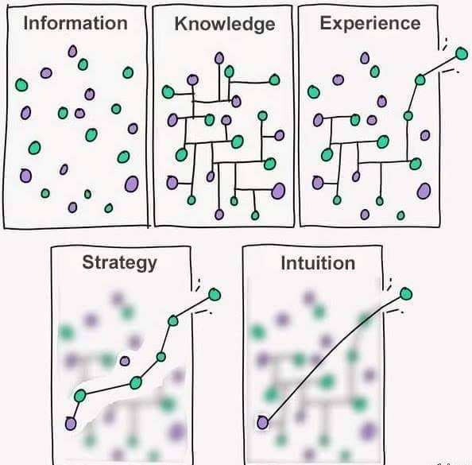

# From Information to Intuition: A Graph-Based Perspective

This model explains how raw data transforms into high-speed decision-making using **graph theory**.

## 1. Information
- **Definition:** Disconnected data points with no context.
- **Graph:** Isolated nodes.
- **Goal:** Increase coverage — collect more diverse nodes.

## 2. Knowledge
- **Definition:** Data points connected by relationships.
- **Graph:** Nodes + edges forming a knowledge graph.
- **Goal:** Build meaningful, validated connections.

## 3. Experience
- **Definition:** Practical use of the knowledge graph.
- **Graph:** Traversed paths with feedback loops.
- **Goal:** Learn which routes produce real-world results.

## 4. Strategy
- **Definition:** Deliberate path selection to achieve a goal.
- **Graph:** Optimized routes using algorithms like shortest path or minimal spanning tree.
- **Goal:** Minimize wasted moves, maximize impact.

## 5. Intuition
- **Definition:** Fast, subconscious route selection based on pattern recognition.
- **Graph:** High-weight shortcuts across the graph.
- **Goal:** Act quickly without sacrificing accuracy.

---

**Key Idea:**  
A thriving decision-making system treats *information* as nodes, *relationships* as edges, and *actions* as optimized paths across this graph.  
From gathering facts to building strategies, graph thinking provides a mental model for navigating complexity.
